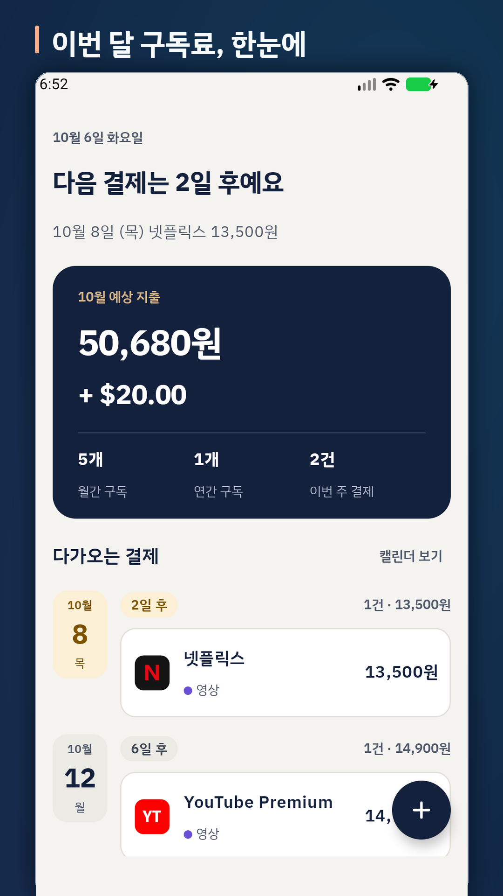
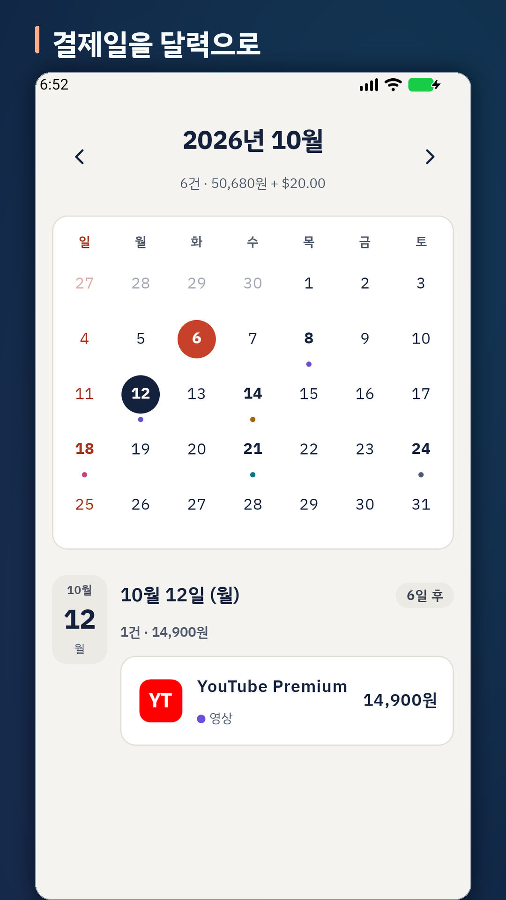
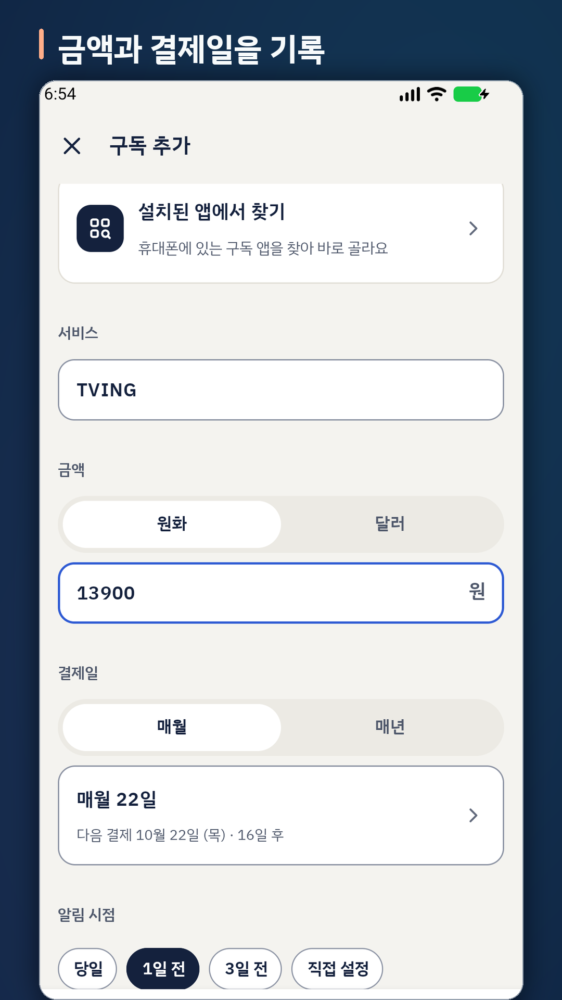
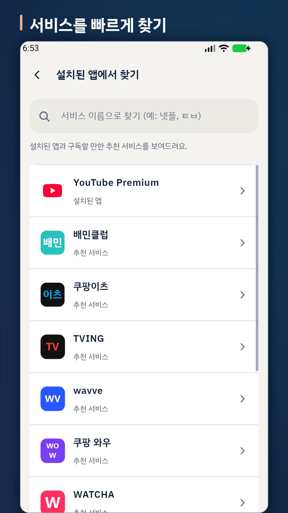

# 구독체크

흩어진 구독, 한눈에 체크. 넷플릭스·유튜브 프리미엄·ChatGPT 같은 구독의 결제일과 금액을 모아 보고, 결제 전에 알림을 받는 Android 앱입니다.

<p>
  
  
  
  
</p>

## 주요 기능

- **홈**: 다음 결제까지 남은 날, 오늘 결제 배너, 이번 달 예상 지출(원화·달러 따로), 날짜별 다가오는 결제, 카테고리별 지출
- **캘린더**: 월별 결제일과 선택한 날의 결제 목록
- **구독 추가**: 서비스 이름·금액(원화/달러)·매월/매년 결제일, 카테고리·결제수단·메모(해지 방법 등)
- **설치된 앱에서 찾기**: 휴대폰에 설치된 구독 앱과 추천 서비스를 골라 바로 입력
- **결제 알림**: 결제 당일부터 30일 전까지 구독마다 알림 시점을 정하고, 알림 시각은 전체에 하나로 설정
- 라이트·다크 모드, 시작 화면 애니메이션

구독 데이터는 기기 안(Room DB)에만 저장하고 서버로 보내지 않습니다. 자세한 내용은 [개인정보처리방침](docs/privacy-policy-ko.md)을 참고하세요.

## 기술 스택

| 영역 | 사용 |
|---|---|
| 언어·빌드 | Kotlin 2.1, AGP 8.9, Gradle 8.11, KSP |
| SDK | minSdk 24 · compileSdk/targetSdk 36 |
| UI | Android View + ViewBinding, Material 3, Navigation, SplashScreen API |
| 데이터 | Room 2.7(스키마 내보내기·마이그레이션 테스트), DataStore |
| 백그라운드 | WorkManager(결제 알림) |
| 그 외 | AdMob(홈 배너), Firebase Analytics·Crashlytics·Performance |
| 글꼴 | IBM Plex Sans KR (SIL OFL 1.1, `app/src/main/assets/licenses`) |

## 프로젝트 구조

```
app/src/main/java/com/management/subscription/
├── home/              홈 화면(요약 카드, 오늘 결제 배너, 카테고리별 지출)
├── calendar/          캘린더
├── editor/            구독 추가·수정, 결제일·알림 시점 시트
├── subscriptionlist/  월간·연간 구독 목록
├── services/          서비스 카탈로그, 설치된 앱에서 찾기
├── settings/          설정
├── notifications/     알림 채널·권한, WorkManager 예약
├── splash/            시작 화면 애니메이션
├── domain/            결제일·알림일 계산, 카테고리별 합계
├── data/              Room DB, 저장소, 설정(DataStore)
├── analytics/         Firebase 이벤트 정의
├── ads/               AdMob 배너
└── ui/, util/         공통 표시 문구·포맷터
```

## 빌드

Android Studio(최신 안정판)로 열거나 명령줄에서 빌드합니다. JDK 17 이상이 필요합니다.

```bash
./gradlew assembleDebug
```

### 로컬 설정 파일

저장소에 없는 파일이 있어야 빌드되는 기능이 있습니다.

| 파일 | 용도 | 없을 때 |
|---|---|---|
| `app/google-services.json` | Firebase 프로젝트 설정 | Firebase 콘솔에서 내려받아 넣어야 빌드됩니다 |
| `keystore.properties` + 업로드 키(`*.jks`) | 릴리즈 서명 | 서명되지 않은 릴리즈가 만들어집니다. [`keystore.properties.example`](keystore.properties.example) 참고 |

AdMob 앱 ID와 광고 단위 ID는 `gradle.properties`에 있습니다. 값이 없으면 Google 테스트 광고 ID를 씁니다.

### 빌드 옵션

| 옵션 | 설명 |
|---|---|
| `-PUSE_REAL_DEBUG_ADS=true` | 디버그 빌드에서도 실제 광고 단위 사용(기본은 테스트 광고) |
| `-PADMOB_TEST_DEVICE_IDS=ID1,EMULATOR` | 테스트 기기로 등록할 기기 ID |
| `-PENABLE_DEBUG_ANALYTICS=true` | 디버그 빌드에서 Firebase 수집 켜기(DebugView 확인용). 릴리즈는 항상 수집 |

### 릴리즈

```bash
./gradlew bundleRelease
```

`app/build/outputs/bundle/release/app-release.aab`가 만들어집니다. 서명 설정은 [docs/release-signing-ko.md](docs/release-signing-ko.md), 출시 전 확인 항목은 [docs/play-store-release-checklist-ko.md](docs/play-store-release-checklist-ko.md)를 참고하세요.

## 테스트

```bash
./gradlew testDebugUnitTest          # 단위 테스트(카테고리별 합계, 오늘 결제 이름 줄, 분석 이벤트)
./gradlew connectedDebugAndroidTest  # 기기·에뮬레이터 필요(Room 마이그레이션 테스트)
```

## 문서

| 파일 | 내용 |
|---|---|
| [docs/privacy-policy-ko.md](docs/privacy-policy-ko.md) | 개인정보처리방침 원본. `scripts/build_privacy_policy_html.py`로 웹용 HTML을 만듭니다 |
| [docs/store/](docs/store/) | Play 스토어 아이콘·그래픽 이미지·스크린샷(현재 버전) |
| [docs/play-store-copy-ko.md](docs/play-store-copy-ko.md) | 스토어 등록 문구 |
| [docs/release-signing-ko.md](docs/release-signing-ko.md) | 업로드 키·서명 설정 |
| [docs/play-store-release-checklist-ko.md](docs/play-store-release-checklist-ko.md) | 출시 체크리스트 |

## 라이선스

앱 코드의 라이선스는 아직 정하지 않았습니다. 번들된 IBM Plex Sans KR 글꼴은 SIL Open Font License 1.1을 따릅니다.
